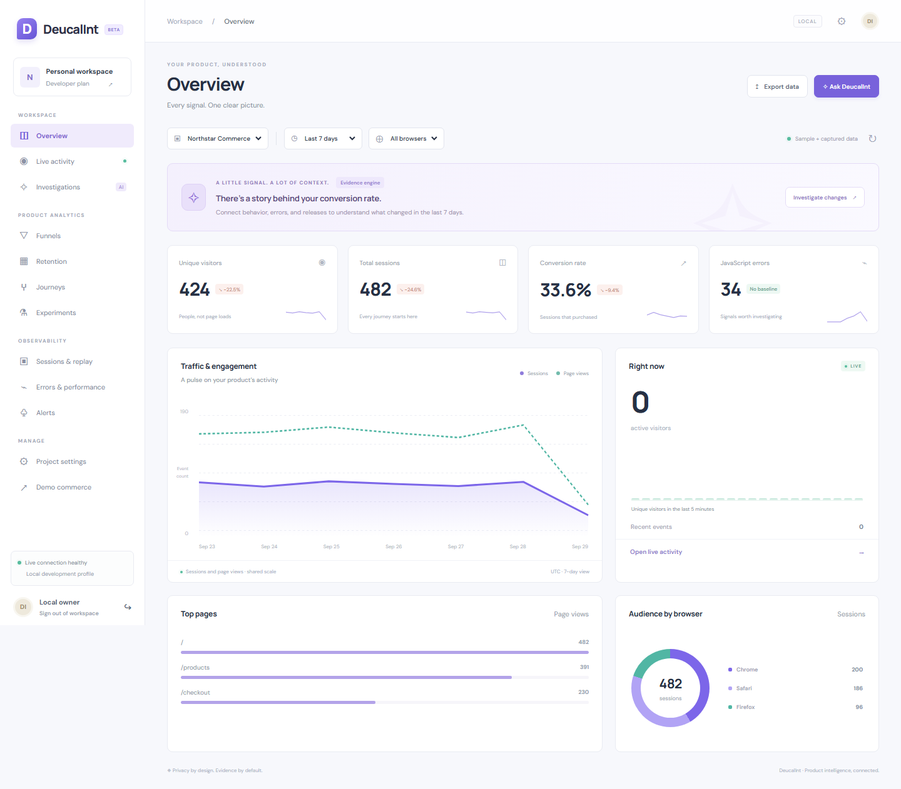

# DeucalInt — Real-Time Behavioral Intelligence & Product Observability Platform

**An AI-powered product intelligence platform that explains what changed, why it changed, and what evidence caused it.**

DeucalInt connects product events, session behavior, frontend errors, performance observations, deployment history, statistical anomalies, and inspectable investigation evidence.



## Start locally

Requires Node.js 22.12+ (tested with 24), npm, and Python 3.11+. No Docker, database installation, API key, or Python package installation is needed for the local profile.

```sh
npm ci
npm run build
python apps/local-api/server.py
```

Open **http://127.0.0.1:8100**. The local owner password is `deucalint-local`; the viewer password is `deucalint-viewer`. Credentials are prefilled in the development sign-in screen. Override them with `DEUCALINT_PASSWORD` and `DEUCALINT_VIEWER_PASSWORD`.

On this Windows machine, the global `npm.ps1` shim was broken. Use this executable if `npm` fails:

```powershell
& 'C:\Program Files\nodejs\npm.cmd' ci
& 'C:\Program Files\nodejs\npm.cmd' run build
python apps/local-api/server.py
```

For hot reload, keep the Python API running and use `npm run dev` in a second terminal; open http://127.0.0.1:4200. For a no-seed workspace, start with `--no-seed` and a fresh `DEUCALINT_DB` path.

## What works

- Responsive Angular dashboard, project/date/browser filters, CSV-free JSON exports, and saved segments.
- Durable asynchronous local ingestion, event validation, deduplication, privacy scrubbing, rate limits, and project-scoped queries.
- TypeScript browser SDK: explicit consent, DNT, batched delivery, retry/backoff, bounded persistent queue, SPA navigation, clicks, scroll, forms, errors, fetch/XHR timing, performance observations, and masked geometric replay.
- Core metrics, realtime SSE, ordered/time-bounded funnels, exact-day retention, journey transitions, session timelines, and experiment statistics.
- Error/network/performance views, release history, median/MAD anomalies, ranked correlated contributors, and evidence-backed investigations.
- In-app alerts, owner/viewer authorization, local token rotation, retention cleanup, visitor/session erasure, and redelivery tombstones.
- Java collector → Redpanda → Java worker → ClickHouse → Java read API code, plus a dashboard adapter for this profile.
- Optional FastAPI/Ollama planner, Node and Java SDKs, tests, benchmark tooling, monitoring, CI, and deployment files.

**This is a working development implementation, not a completed production version of every roadmap item.** The [phase report](docs/PHASES.md) distinguishes implemented local features, supplied-but-unverified infrastructure, and remaining engineering work. In particular, the distributed containers and Ollama model were not run on this machine.

## Two explicit runtime profiles

| Profile | Data path | Dashboard | Status |
|---|---|---|---|
| Local | SDK → SQLite durable inbox → worker → scoped Python API → Angular | `:8100` or Vite `:4200` | Locally tested |
| Distributed | SDK → Spring WebFlux → Redpanda → worker → ClickHouse → Spring read API → Python dashboard adapter → Angular | `:8200` | Java build tested; container integration not run here |

Local data lives in `.data/deucalint.db`. The commerce project starts with a deterministic 35-day sample; **Empty sandbox** has no seed. The UI labels sample data. Live activity always uses actual events in the last five minutes.

```sh
# Docker alternative for the local profile
docker compose up --build

# Distributed profile, including the separate local demo
docker compose --profile distributed up --build

# After distributed services are ready
python tests/integration/distributed_smoke.py

# Optional metrics dashboards
docker compose --profile distributed --profile monitoring up --build
```

Distributed management operations that are not implemented return 501 instead of silently modifying a different database. Valkey and MinIO are optional extension infrastructure; they are not connected to the current event path.

## Verify

```sh
npm run check
python -m unittest discover -s tests -p 'test_*.py' -v
npx playwright install chromium
npm run test:e2e
mvn verify
python benchmarks/evaluate.py
```

`mvn verify` runs Java contracts and SDK delivery tests. Its Testcontainers broker test skips explicitly when Docker is unavailable. Browser tests cover navigation, evidence cards, desktop/mobile layouts, and SDK → API → live feed delivery.

Read [manual testing](docs/MANUAL_TESTING.md), [architecture](docs/architecture/README.md), [API contracts](docs/api/README.md), [SDK usage](docs/sdk/README.md), [threat model](docs/threat-model/README.md), and [verification results](docs/VERIFICATION.md).

## Demo material

- Portfolio page: http://127.0.0.1:8100/about.html
- Instrumented store: http://127.0.0.1:8100/#demo
- [Recorded walkthrough](docs/media/walkthrough.webm)
- Regenerate screenshots/video with `node infrastructure/scripts/record-demo.mjs` while the local app is running.
- [Measured local analytics and synthetic detector evaluation](docs/benchmarks/local-results.json). These numbers are not distributed ingestion benchmarks.

## Repository map

```text
apps/dashboard      Angular dashboard and demo store
apps/local-api      Runnable local API / distributed dashboard adapter
apps/platform       Spring collector, consumer, read API (role-selected)
apps/ai-engine      Evidence calculations, FastAPI, optional Ollama planner
packages            Browser, Node, Java SDKs and protocol schemas
database            PostgreSQL metadata and ClickHouse event migrations
infrastructure      Docker, monitoring, Kubernetes demo manifest, scripts
tests               Unit, HTTP contract, browser, integration and chaos checks
benchmarks          k6, synthetic traffic, algorithm evaluation
docs                Phase status, manual tests, ADRs, verification and demo media
```
