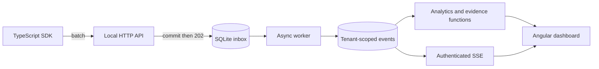
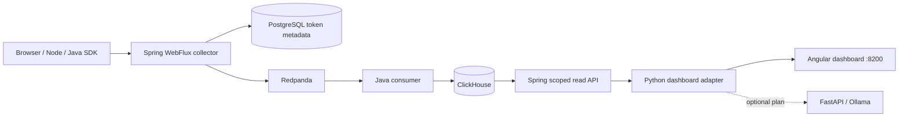

# Architecture

## Local profile

The Python standard-library server is a development runtime. It provides deterministic datasets, durable ingestion, the entire UI contract, and isolated integration tests without Docker. Connections are short-lived and closed after every transaction. One worker processes bounded inbox batches. Queries cap data at 100,000 events and fail explicitly when that bound is exceeded.

## Distributed profile

Collector, worker and read API share one Java codebase and run with different `SERVICE_ROLE` values. This avoids duplicated transport contracts while preserving separate deployment/process boundaries. Collector blocking work runs on boundedElastic, not the WebFlux event loop. Warehouse outages do not turn ingestion into synchronous database writes.

The dashboard adapter computes the current analytical features over bounded event extracts. It is a stepping stone to fully parameterized aggregate queries in Java/ClickHouse, not an efficient architecture for billions of events. Saved reports/alerts still use adapter-local SQLite. Distributed writes for lifecycle/settings/rotation are disabled with an explicit 501 response.

## Analytical definitions

- A session is a distinct session ID, excluding deployment-only records. A visitor is a distinct anonymous ID. There is no identity stitching yet.
- Conversion is sessions containing `purchase_completed` divided by observed sessions, not checkout-start conversion.
- Bounce is sessions with at most one page view divided by all observed sessions. This is a simple page-count definition.
- Ordered funnels require steps in timestamp order in the same session within a configurable window. Unordered mode still requires the entry step first. Best qualifying attempt wins; sessions are counted once.
- Retention is exact UTC-day activity relative to first observation inside the selected range. Cohorts are seven-day buckets. Unmatured cells are null.
- API latency uses nearest-rank p95; performance cards use p75 of captured observations. Missing performance signals are not automatically equivalent to healthy UX.
- Experiments count purchases after exposure by anonymous visitor within the chosen range. Visitors exposed to multiple variants are excluded. This does not replace randomized assignment or sequential-testing corrections.
- Anomaly scores use a rolling median/MAD and a minimum 20-session bucket; they are not seasonal forecasts.
- Investigations split the selected interval into equal halves, rank overlapping conversion contributors, and preserve evidence values and sample counts. Temporal correlation never implies causality.

Read the twelve [architecture decision records](../adr/) and the [phase report](../PHASES.md) for scope and tradeoffs.
